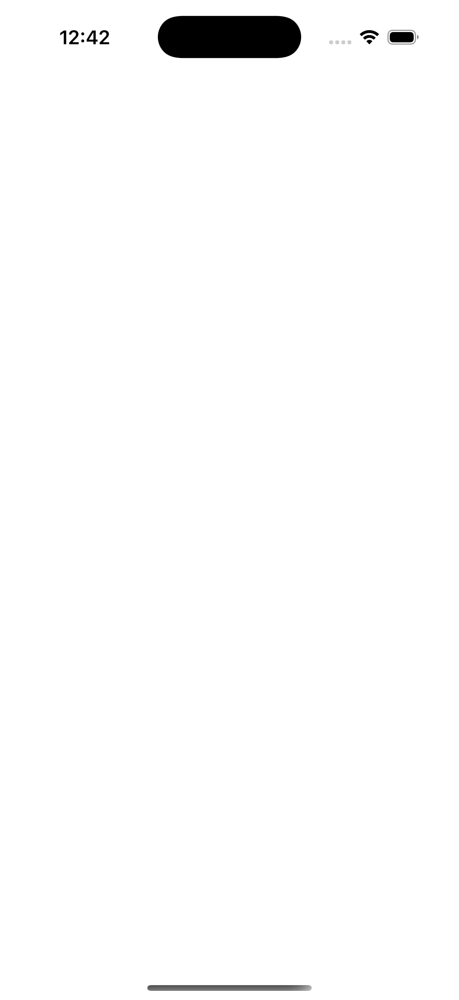

# Timeline Notebook 📝

A personal timeline notebook Flutter app - like Twitter/X but for your private notes with images and tags.

## Features ✨

- **📱 Chronological Timeline** - View your notes in a clean, reverse-chronological feed
- **✍️ Create Notes** - Write short notes with text content
- **📷 Attach Images** - Add photos from camera or gallery to your notes
- **🏷️ Free-form Tags** - Use #hashtags to organize your notes (e.g., #work, #ideas, #shopping)
- **🔍 Search** - Find notes by content quickly
- **⭐ Favorites** - Mark important notes as favorites
- **🗑️ Swipe to Delete** - Easy gesture-based deletion with confirmation
- **🔄 Pull to Refresh** - Stay up to date with your timeline
- **💾 Local Storage** - All data stored locally on your device using SQLite

## Screenshots

### Timeline View
Your personal timeline notebook - clean, simple, and private


## Getting Started 🚀

### Prerequisites

- Flutter 3.29.2 or higher
- Dart 3.7.2 or higher
- iOS 13.0+ or Android 5.0+

### Installation

1. Clone the repository:
```bash
git clone https://github.com/xinzhang/flutter_timeline_notebook.git
cd flutter_timeline_notebook
```

2. Install dependencies:
```bash
flutter pub get
```

3. Run the app:
```bash
# For iOS
flutter run

# For Android
flutter run
```

## Tech Stack 🛠️

- **Flutter 3.29.2** - Cross-platform UI framework
- **Dart 3.7.2** - Programming language
- **sqflite** - Local SQLite database storage
- **image_picker** - Camera and gallery access
- **path_provider** - File system access
- **intl** - Date and time formatting

## Project Structure 📁

```
lib/
├── database/
│   └── database_helper.dart    # SQLite database operations
├── models/
│   ├── note.dart                 # Note data model
│   └── tag.dart                  # Tag data model
├── screens/
│   ├── timeline_screen.dart      # Main timeline feed
│   ├── compose_screen.dart       # Create new notes
│   └── search_screen.dart        # Search notes
├── services/
│   └── tag_service.dart          # Tag extraction and management
└── widgets/
    ├── note_card.dart            # Note display widget
    └── tag_chip.dart             # Tag display widget
```

## Usage 💡

### Creating a Note

1. Tap the **+** button in the center of the bottom navigation bar
2. Enter your note content
3. Optionally add images using the camera or gallery buttons
4. Add hashtags like `#work` or `#ideas` to categorize your notes
5. Tap **Post** to save

### Searching Notes

1. Tap the **search icon** in the bottom navigation bar
2. Type your search query
3. Results filter instantly as you type

### Organizing with Tags

Simply include hashtags in your note content:
- `Meeting with @john about #project-alpha`
- `Remember to buy #groceries: milk, eggs, bread`
- `Great idea for #app-development`

Tags are automatically extracted and displayed on your notes.

### Managing Notes

- **Favorite**: Tap the star icon on any note
- **Delete**: Swipe left on any note and confirm deletion
- **Refresh**: Pull down on the timeline to refresh

## Testing 🧪

Run the unit test suite:

```bash
flutter test
```

Current test coverage: **38 tests passing**

## Development 🛠️

This project was built using Test-Driven Development (TDD) principles with comprehensive code reviews at each step.

### Build for Production

```bash
# iOS
flutter build ios

# Android
flutter build apk
```

## License 📄

This project is open source and available under the MIT License.

## Acknowledgments 👏

- Built with [Flutter](https://flutter.dev/)
- Icons from [Material Design](https://material.io/)

---

**Made with ❤️ using Flutter**
